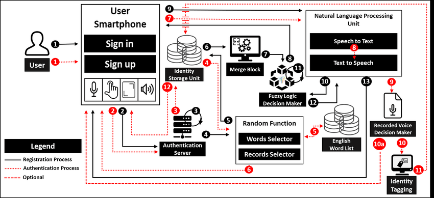
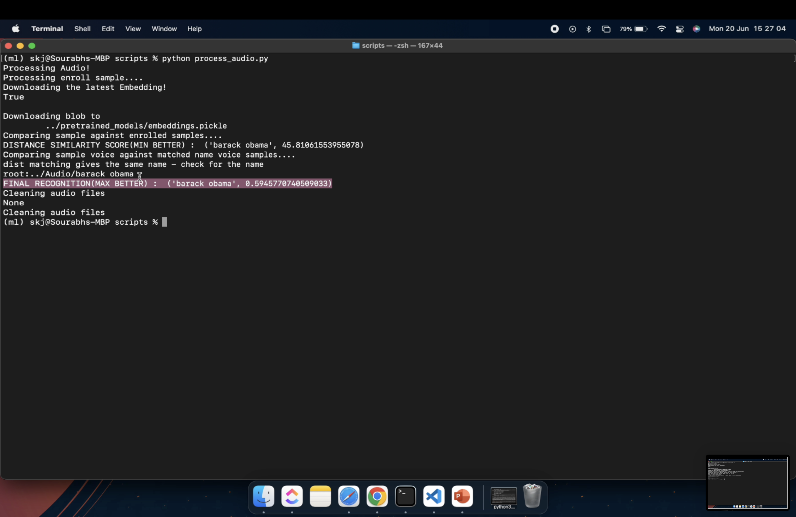

# [SBI - Voice Biometrics](https://www.techgig.com/hackathon/voice-biometrics)

## Objective
```
Customers interact with the Bank via various channels such as Contact Centre & Video based Customer Identification Process Calls. Authentication measures of Caller ID / PIN / Security Questions / Device Signatures are often inadequate and intrusive.
```

## Solution Expected:
```
For a sample voice clip, develop a voice signature for authentication with other voice samples & further develop the Voice signature as per repeated voice samples.
The following are the expectations from the prototype:
    1. To Authenticate & continuously enhance Voice Signatures of Customers for interaction with the Bank via following channels:
            Contact Centre
            Mobile App
            Video Customer Identification Process
    2.Voice as additional factor of authentication
    3.Response as a Percentage of model of Voice
```

## Solution Architecture - POC


## Solution Architecture - PROD



## Solution Samples

### Enroll Voices from a Directory


### Enroll a single vocie with a name


### Match Voice with a given name - when Distance Scoring Output matches with given name




### Match Voice with a given name - when Distance Scoring Output do not match with given name


### Match Voice without a given name


