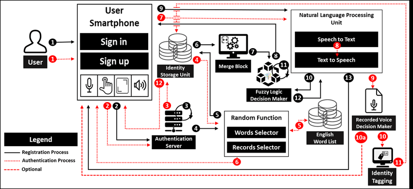

# [SBI - Voice Biometrics](https://www.techgig.com/hackathon/voice-biometrics) - Idea submission

## Objective
```
Customers interact with the Bank via various channels such as Contact Centre & Video based Customer Identification Process Calls. Authentication measures of Caller ID / PIN / Security Questions / Device Signatures are often inadequate and intrusive.

Solution Expected:
For a sample voice clip, develop a voice signature for authentication with other voice samples & further develop the Voice signature as per repeated voice samples.
The following are the expectations from the prototype:
    1. To Authenticate & continuously enhance Voice Signatures of Customers for interaction with the Bank via following channels:
            Contact Centre
            Mobile App
            Video Customer Identification Process
    2.Voice as additional factor of authentication
    3.Response as a Percentage of model of Voice
```

## Solution Proposed (POC)
```
The idea is to use the following:

- The identity storage unit store the user’s recorded voice sample along with the pitch of voice segments. Furthermore, it contains detailed information about each recorded sample, which includes the sample rate, bits per sample, number of channels, device identity, current sample, total samples, start event, stop event, timer event, time-period, tag, user data, type, and label. (Azure Blob Storage)
- The natural language processing unit consists of two submodules: i) Speech to Text takes the user voice input and converts it into text. ii) Text to Speech take text as an input and convert it into speech (Azure Cognitive Service for Speech)
- Custom model to compare user given voice to saved voice

The FLow of Processing:

1. The flow starts with the user saying something for authentication.
2. Once a new voice is uploaded (synchronized) in Azure Blob Storage, it shall be immediately processed.
3. Azure Blob storage has a trigger that executes a simple Azure function that sends the message to Azure Queue
4. Azure Queue has a trigger that executes an advanced Azure function that 
    1) retrieves voice sample from a blob storage account and the saved voice sample for the user
    2) extract required features by calling the custom model and the match(True/False)
    3) writes results to an Azure database
```

## Architecture (POC)
